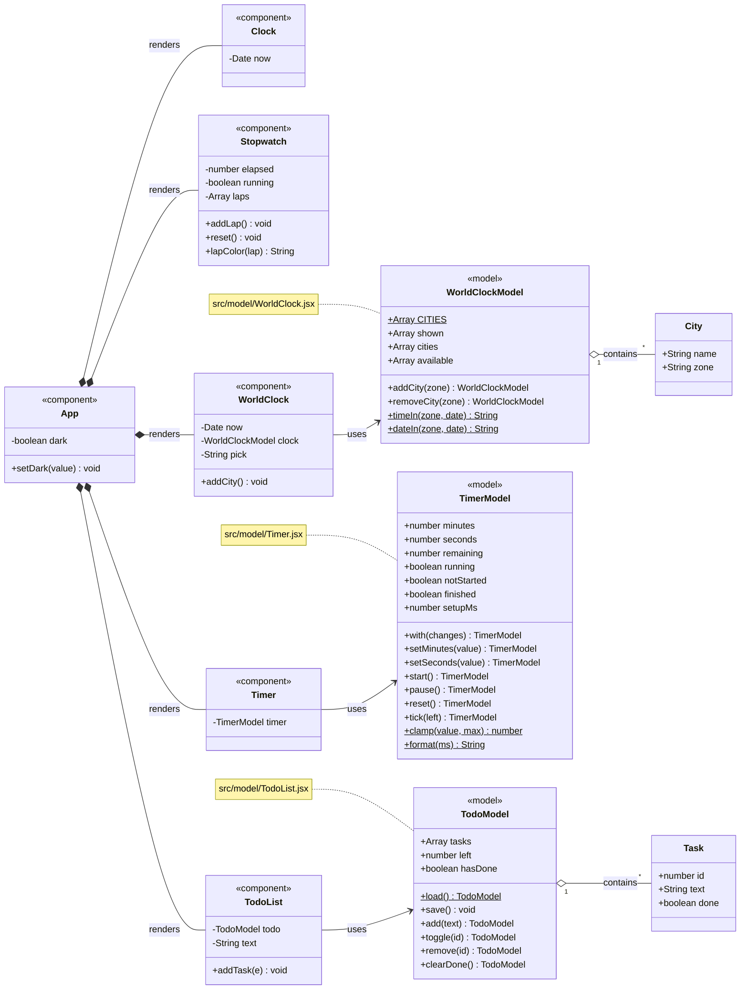

# Clock + Stopwatch (React + CSS)

1. npm install
2. npm run dev
3. Open http://localhost:5173

# Class Diagram

Class diagram of the Clock + Stopwatch + More app.

- **Components** draw the screen.
- **Models** hold the data and rules for the three new features: World Clock, Timer and To-Do List.

## Legend

| Symbol | Meaning |
|---|---|
| `<<component>>` | React component that draws part of the screen |
| `<<model>>` | Class that holds data and rules for a feature |
| `*--` | `App` renders that component |
| `-->` | A component uses its model |
| `o--` | A model contains a list of items |
| `$` | Static member, called on the class itself (for example `TimerModel.format()`) |